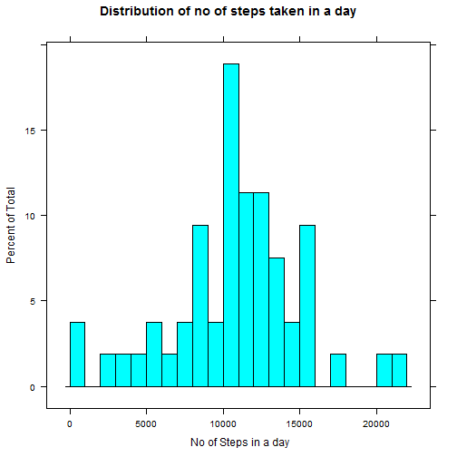
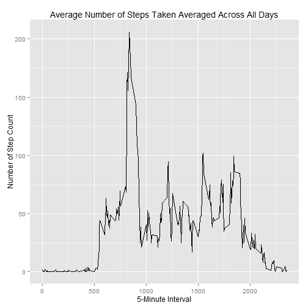
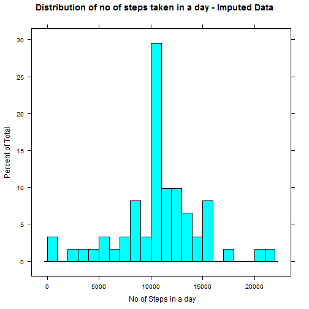
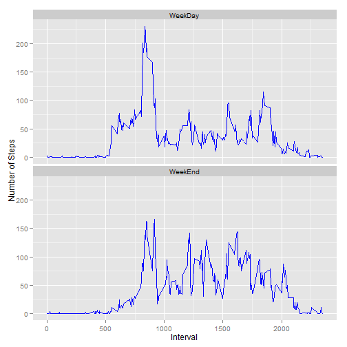

---
  
  
The first step is to read and process the data for analysis

The github repo of the assignment was forked and cloned on the local desktop

The data file is unzipped and available as activity.csv

Getting the Data ready
---


```r
rawData <- read.csv("activity.csv", header = T, colClasses = c("numeric", "Date", "numeric"));
NoNAData <- na.omit(rawData);
daySteps <- aggregate(steps ~ date, data = NoNAData, FUN = sum)
```

Part 1 of Assignment - Analyzing number of steps in a Day
---

Will use lattice for plotting


```r
library(lattice)
histogram(daySteps$steps, breaks = 25, xlab = " No of Steps in a day", main = "Distribution of no of steps taken in a day");
```

 

```r
## Mean

meandata <- mean(daySteps$steps);

## Median

mediandata <- median(daySteps$steps)
```

### Mean of Steps is 10766

### Median of Steps is 10765


Part 2 - Analyzing number steps for each time interval
---

First find the mean for each time interval

Continue to use the data without NAs

Will use ggplot this time


```r
intervalSteps <- aggregate(steps ~ interval, data = NoNAData, FUN = mean);

library(ggplot2);

qplot(x=interval, y=steps, data = intervalSteps,  geom = "line",
      xlab="5-Minute Interval",
      ylab="Number of Step Count",
      main="Average Number of Steps Taken Averaged Across All Days")
```

 

```r
maxsteps <- intervalSteps$steps[which.max(intervalSteps$steps)]
maxinterval <- intervalSteps$interval[which.max(intervalSteps$steps)]
```


### Maximum No of Steps 206 at the Interval of 835


Part 3 - Imputing the values of missing data
---

Finding extent of missing data


```r
  sum(is.na(rawData))
```

```
## [1] 2304
```

Will use a basic strategy of filling the mean of the interval data into the respective values

Will use the 5 minute mean interval data to fill the the NAs


```r
     impData <- merge(rawData, intervalSteps, by = "interval", suffixes = c("", ".y"))
     naData <- is.na(impData$steps)
     impData$steps[naData] <- impData$steps.y[naData]
     impData <- impData[, c(1:3)]
```

Plot the imputed data with daily new steps


```r
daySteps <- aggregate(steps ~ date, data = impData, FUN = sum)
histogram(daySteps$steps, breaks = 25, xlab = " No of Steps in a day", main = "Distribution of no of steps taken in a day - Imputed Data");
```

 


show the new mean and median


```r
## Mean

mean(daySteps$steps);
```

```
## [1] 10766.19
```

```r
## Median

median(daySteps$steps)
```

```
## [1] 10766.19
```
Part 4 - Check the difference betweek weekend and weekday
---

First identify the name of day of the week for each date

Split the data into weekend data consisting of Saturday and Sunday
Week Day data for the rest

Compute the mean for each file

Insert the type of Weekend and Weekday into the respective file

Combine the file and generate the plot


```r
library(timeDate)
  impData$weekdayName <- weekdays(impData$date, abbreviate = TRUE);
  weekdayData <- subset(impData, !weekdayName %in% c("Sun", "Sat"));
  weekendData <- subset(impData, weekdayName %in% c("Sun", "Sat"));
  str(weekdayData);
```

```
## 'data.frame':	12960 obs. of  4 variables:
##  $ interval   : num  0 0 0 0 0 0 0 0 0 0 ...
##  $ steps      : num  1.72 0 0 0 0 ...
##  $ date       : Date, format: "2012-10-01" "2012-11-23" ...
##  $ weekdayName: chr  "Mon" "Fri" "Tue" "Thu" ...
```

```r
  str(weekendData);
```

```
## 'data.frame':	4608 obs. of  4 variables:
##  $ interval   : num  0 0 0 0 0 0 0 0 0 0 ...
##  $ steps      : num  0 0 0 0 1.72 ...
##  $ date       : Date, format: "2012-10-28" "2012-11-24" ...
##  $ weekdayName: chr  "Sun" "Sat" "Sat" "Sun" ...
```

```r
  weekdaySteps <- aggregate(steps ~ interval, data = weekdayData, FUN=mean);
  weekendSteps <- aggregate(steps ~ interval, data = weekendData, FUN=mean);
  weekdaySteps$dayType <- "WeekDay";
  weekendSteps$dayType <- "WeekEnd";
  dataWithDayofWeek <- rbind(weekdaySteps, weekendSteps);
  ggplot(dataWithDayofWeek, aes(x=interval, y=steps)) + 
  geom_line(color="blue") +
  facet_wrap(~ dayType, nrow=2, ncol=1)+
  labs(x="Interval", y="Number of Steps")
```

 

```r
## Also let us view the difference in mean for weekday and weekend
## Weekday Mean
mean(weekdaySteps$steps)
```

```
## [1] 35.61058
```

```r
## Weekend Mean
mean(weekendSteps$steps)
```

```
## [1] 42.3664
```
